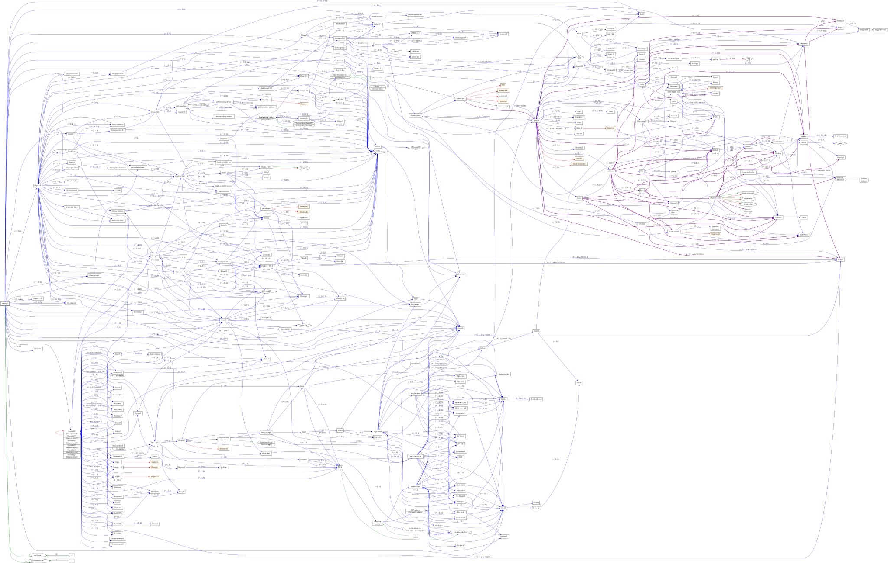

<!-- _paginate: false -->
<!-- _class: title -->

# 純粋関数型パッケージマネージャの追実装

2021 年度 情報特別演習最終発表会
小川 広水

---

# はなすこと

導入: Nix の紹介

- 既存のシステムの問題
- Nix の紹介
- Nix が解決する問題

やったこと: Nix の追実装

- デモ
- コンセプトの紹介

---

<!-- _class: lead -->

# 導入: Nix の紹介

---

# 問題: パッケージ管理の難しさ

一度変更を適用してしまうと楽には元に戻せない

```bash
$ apt install package1
# システム上の別の部分が壊れてしまった！
$ apt purge package1
# しかしインストール前の状態に必ず戻るとは限らない…
```

- 同様にアンインストール、アップグレードに非常に慎重になる必要がある
- しかし実際としてシステムの更新は継続的に行う必要がある

---

# 問題: バージョン制約



---

# Nix とは

> Nix, the purely functional package manager - [NixOS/nix](https://github.com/NixOS/nix)

- 「純粋関数型パッケージマネージャ」
- ソースベースのパッケージマネージャ
  - 私たちが用意するのはソースとビルド手順

<!-- _footer: NixOS という Linux ディストリビューションに使われているが、別の Linux ディストリビューション・macOS などでも利用可能 -->

---

# Nix とは: パッケージ



---

# Nix とは: パッケージ


---

# Nix による解決: 固定された依存関係

- **パッケージ定義の時点で依存ツリーを固定**しているため、
  self-contained な閉包をつくることができる
- コンテナ技術や静的リンクと同じ方向性のアプローチで dependency hell を解決

<!-- _footer: 閉包をつくるまでは同じパッケージに対する依存は共有されている -->

---

# Nix による解決: ロールバック可能な管理

```
/etc
├── bashrc -> /nix/store/1if176wh1r4x9s7y1az71jfl5kbmh98j-etc-bashrc
├── dbus-1 -> /nix/store/4flwcifazgfgf161sy6814b0rbn7v34s-dbus-1
├── default
│   └── useradd -> /nix/store/vdlvg48amgd4ypjmbcbc0bphr38zylp7-useradd
├── dhcpcd.exit-hook -> /nix/store/68q2mgnzkrpg4lz1hvi438jvbsdhvm5v-dhcpcd.exit-hook
├── dnsmasq.hosts -> /nix/store/5bc88knzm6vzps0v8ji04dkr4m3bjlaz-etc-dnsmasq.hosts
├── fonts -> /nix/store/i8xwbp6l79m5zqv2li1fqbb7pblzck5s-fontconfig-etc/etc/fonts/
├── fstab -> /nix/store/49wyysybgjykgiahl81cgdvv27z7hcl1-etc-fstab
├── hostname -> /nix/store/gkpkfghwjlpgz5j9hsw5q38j3yqb5izb-etc-hostname
├── hosts -> /nix/store/kx490d701mxgszqmvm321akh3d1d327d-hosts
├── issue -> /nix/store/fc32c1jyxdfz4d4s3ly2q6dn4fk8vpaw-issue
├── locale.conf -> /nix/store/yjw073w6rjs8ixrj7ny1w4g69yrxsj0q-locale.conf
├── localtime -> /etc/zoneinfo/Asia/Japan
…
```

- リンクを貼るのは失敗しないので中間状態が露出しない
- `/nix/store` を不変にすることでリンクの貼り直しによるロールバックが可能に

---

<!-- _class: lead -->

# やったこと: Nix の追実装

---

# 実装をしました

- Nix と同様のアーキテクチャで、別の実装を作る
- Rust で実装

| Files | Lines | Code  | Comments | Blanks |
| ----- | ----- | ----- | -------- | ------ |
| 118   | 11981 | 10506 | 167      | 1308   |

---

# デモ

`haum` コマンドが実装の本体

<script id="asciicast-jvRIQF9rSpS7FZa7ryHSsGcqz" src="https://asciinema.org/a/jvRIQF9rSpS7FZa7ryHSsGcqz.js" async></script>

<!-- _footer: hello というのは [GNU Hello](https://www.gnu.org/software/hello/) のことです -->

---

# コンセプト: 依存先によって識別されるパッケージ

```haskell
Derivation = {
  name: String,           ───── パッケージ名
  sources: {Path},        ───┬─ 依存パス
  dependencies: {Path},   ───┘
  builder: String,        ───── ビルドコマンド
  args: [String],         ───── ビルドコマンドの引数
  envs: {(String, String)},  ── ビルド時の環境変数
}
```

```
packageID(drv) = hash(
  drv.name,
  sort(drv.sources),
  sort(drv.dependencies),
  drv.builder,
  drv.args,
  sort(drv.envs),
)
```

---

# コンセプト: 専用の不変な管理領域

```
/haumea/derivation/{sha256}     - パッケージ定義, input-addressed
├──────/package/{sha256}        - ビルド結果, ↑のハッシュに対応
└──────/content/{sha256}        - content-addressed なデータ
```

- `~/.haumea-env → /package/{sha256}`
- `PATH=~/.haumea-env/bin:$PATH` などとすれば利用できる

---

# 例

```nix
let
  stdenv = import ./pkgs/stdenv.haumea;
in
stdenv.mkDerivation {
  pname = "hello";
  version = "2.10";
  src = builtins.fetchUrl {
    url = "https://ftp.jaist.ac.jp/pub/GNU/hello/hello-2.10.tar.gz";
    sha256 = "34c89df862082bca464bc8073315b06b325655c04ec9eb478360f121666e992d";
    executable = false;
  };
}
```

---

# 例

<script id="asciicast-wch4sSDONlyAAflGZjHBsq74P" src="https://asciinema.org/a/wch4sSDONlyAAflGZjHBsq74P.js" async></script>

---

# まとめ

主に下記の 2 つを実現し、Nix と同様のシステムを追実装することができた

- input-addressed なパッケージ
- メインのファイルツリーから分離して存在する、不変の管理領域

スライド 👇
[`https://coord-e.github.io/slide-specialseminar21-reimpl-functional-package-manager/`](https://coord-e.github.io/slide-specialseminar21-reimpl-functional-package-manager/)

---

<!-- _class: lead -->

# おまけ

---

# がんばり: 豊富な言語機能

```nix
let
  sources = filter (i: typeOf i == "path") buildInputs;
  dependencies = filter (i: typeOf i == "derivation") buildInputs;
in derivation {
  inherit sources dependencies;
  envs = mapValues toString envs
    ++ mapMembers (n: "STDENV_OVERRIDE_#{n}") override
    ++ {
      STDENV_PHASES = phases
        |> filter (x: not (elem x disablePhases))
        |> join ":";
    };
}
```

---

# がんばり: 高機能なエラーレポーティング

<script id="asciicast-SyD4qxL2dZBwgybrPJYoylhOn" src="https://asciinema.org/a/SyD4qxL2dZBwgybrPJYoylhOn.js" async></script>

---

# 容易なビルトイン定義

```rust
#[derive(Debug, FromValue)]
pub struct Arg {
    object: Object,
    member: String,
}

pub async fn call(arg: Arg) -> BuiltinResult<Value, Infallible> {
    let mut object = arg.object;
    object.remove_member(arg.member);
    Ok(Value::Object(object))
}
```

---

# 隔離されたビルド



---

# これまでのあらすじ (1/2)

- ディストリビューションとパッケージマネージャー
  - システムに存在するライブラリのセットをディストリビューションとして固定し、その環境向けにビルドされたものなら動作できるようにする
  - パッケージとしてソフトウェアの依存関係を記述し、デフォルトで存在しないライブラリを利用した際も必ず必要なものが存在しているようにする
  - 各ディストリビューションの**環境への固定**
- 30 億のデバイスで動く Java
  - 共通の VM を用意することで、ビルド結果を共有できるように
  - JVM という**環境への固定**

---

# これまでのあらすじ (2/2)

- Docker に代表されるコンテナ技術
  - 環境を閉じ込めて実行する手段を用意し、実行環境とビルド結果を共有できるように
  - コンテナイメージでファイルツリーごと**環境を配布**
- musl などによって実現される全体の静的リンク
  - 動的リンクによる実行環境への依存を排除することで、ビルド結果を共有できるように
  - バイナリに必要なものをすべて詰めることで**環境も一緒に配布**
